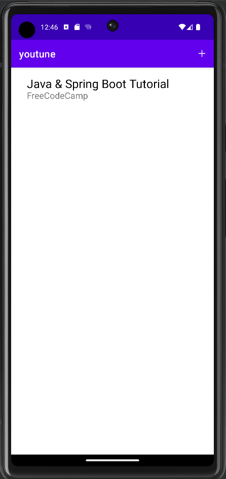

# YouTune
 
Not affiliated with Youtube or Google in any way.

Lightweight Youtube video-aggregation/playlist app for Android. Standalone, not integrated with Youtube. Works by entering a video ID. Can edit your own data you want to store about videos. Also supports actually watching the videos!

## To use
First, take the ID of a video you want to store in your library.

Then, if you exit out of the form, you will see the video name and creator's name that you set for the video in your recycler view. 

Then if you select your new entry, you'll see the data that you set, and be able to watch the video from there.

